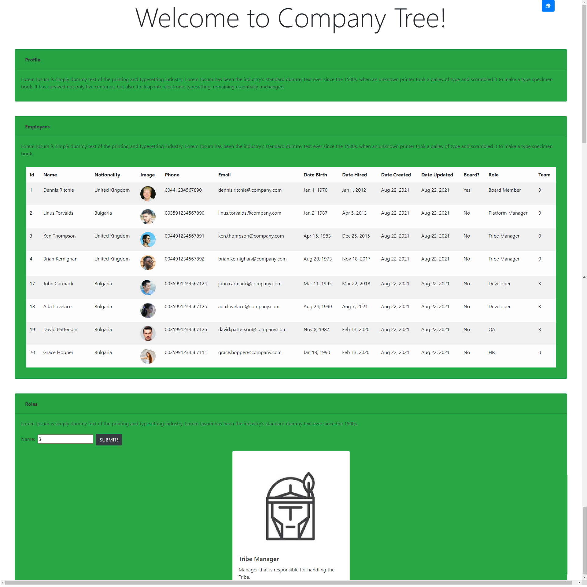

# PT_WebApp_CompanyTree

## General Information

PT_WebApp_CompanyTree is a web application that handles communication between a backend .NET Core server and a frontend Angular app.  
It should dynamically visualize information about an imaginery Company, its Employees, Roles and Teams...

## Technologies

Backend:
- .NET Core Web API
	- dbup
	- Dapper
- SQL Server Database

Frontend:
- Angular app

## Contents

### ang
### res
### src

\~THE END\~
